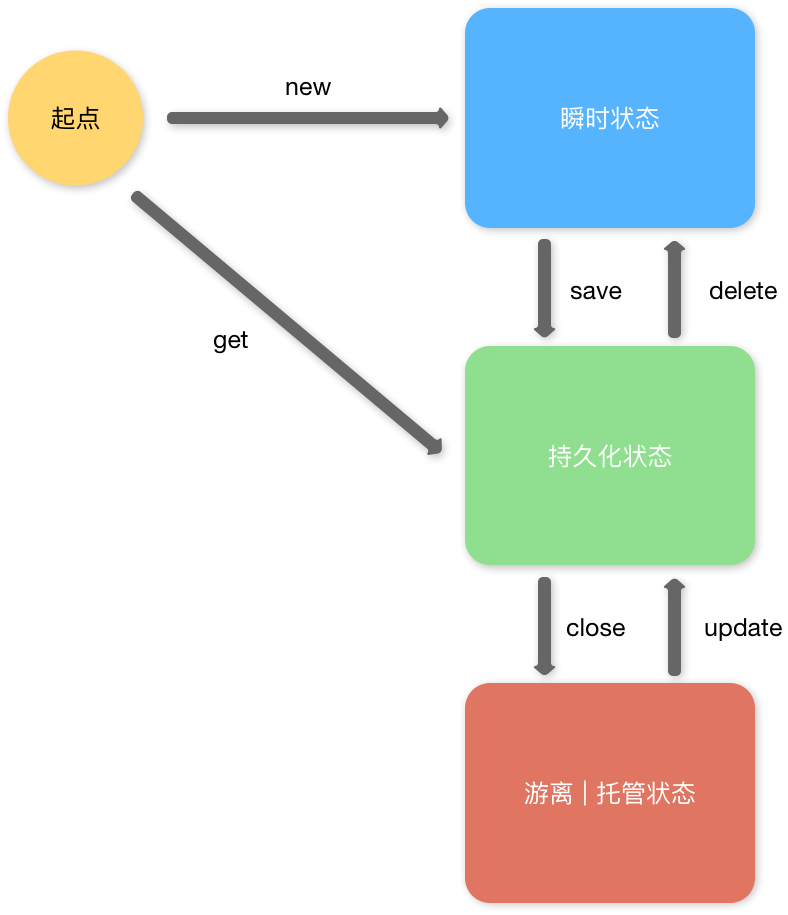
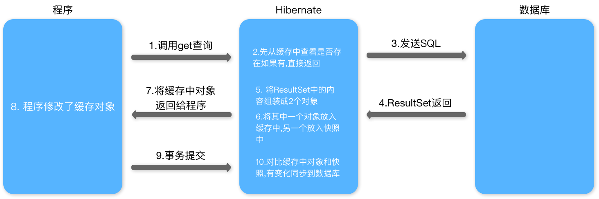

## Hibernate框架

+ dao层框架
+ 以面向对象方式操作数据库
+ orm思想,对象关系映射,通过映射文件配置对象与数据库中表的关系

### Hibernate主配置

hibernate.cfg.xm

```xml
<?xml version="1.0" encoding="UTF-8"?>
<!DOCTYPE hibernate-configuration PUBLIC
	"-//Hibernate/Hibernate Configuration DTD 3.0//EN"
	"http://www.hibernate.org/dtd/hibernate-configuration-3.0.dtd">
<hibernate-configuration>
	<session-factory>
	  <!-- 必选配置 -->
	  
		<!-- 数据库驱动 -->
		<property name="hibernate.connection.driver_class">com.mysql.jdbc.Driver</property>
		<!-- 数据库url -->
		<property name="hibernate.connection.url">jdbc:mysql:///数据库名</property>
		<!-- 数据库连接用户名 -->
		<property name="hibernate.connection.username">用户名</property>
		<!-- 数据库连接密码 -->
		<property name="hibernate.connection.password">密码</property>
		<!-- 数据库方言 -->
		<property name="hibernate.dialect">org.hibernate.dialect.MySQLDialect</property>
		
		<!-- 可选配置 -->
		
		<!-- 将生成的sql语句显示在控制台 -->
		<property name="hibernate.show_sql">true</property>
		<!-- 将生成的sql语句格式化 -->
		<property name="hibernate.format_sql">true</property>
		<!-- 自动建表 -->
		<!-- creat : 每次框架运行都创建新表 -->
		<!-- update : 表不存在自动生成表,表有变动自动更新表 -->
		<!-- validate : 不自动生成表,每次启动校验表是否正确 -->
		<property name="hibernate.hbm2ddl.auto">update</property>
		
		<!-- 引入ORM元数据 -->
		<mapping resource="src下路径/对象名.hbm.xml" />
		
	</session-factory>
</hibernate-configuration>
```

### ORM元数据

对象名.hbm.xml

```xml
<?xml version="1.0" encoding="UTF-8"?>
<!DOCTYPE hibernate-mapping PUBLIC 
    "-//Hibernate/Hibernate Mapping DTD 3.0//EN"
    "http://www.hibernate.org/dtd/hibernate-mapping-3.0.dtd">
<!-- package填写包名后,下面可以直接写简单类名 -->
<hibernate-mapping package="包名" >
  <!-- 配置实体与表的对应关系 -->
  <class name="类名" table="数据库表名" >
    <!-- 配置主键映射属性 -->
    <id name="类中主键名" column="表中主键名" >
      <!-- 配置主键生成策略 -->
      <!-- identity : 主键自增,由数据库维护 -->
      <!-- squence : Oracle中主键生成策略 -->
      <!-- native : 根据数据库自动选择 -->
      <!-- uuid : 产生随机字符串作为主键,主键类型必须为String -->
      <!-- assigned : hibernate不管理主键值,由开发人员自己维护 -->
      <generator class="native"></generator>
    </id>
    <!-- 配置除id外普通属性映射 -->
    <property name="类中属性名" column="表中列名" ></property>
  </class>
</hibernate-mapping>
```


### HibernateAPI

#### Configuration对象

功能 : 配置加载类,用于加载主配置,orm元数据加载

#### SessionFactory对象

功能 : 创建session对象,保存和使用所有配置信息,消耗资源大,线程安全,所以一个项目只创建一个

```java
// 创建对象
Configuration conf = new Configuration();
// 读取指定配置文件,默认src下hibernate.cfg.xml
conf.configure();
// 根据配置文件,创建SessionFactory对象
SessionFactory sf = conf.buildSessionFactory();
```

#### Session对象

操作数据库的核心对象,表示Hibernate与数据库的连接会话,完成对数据库的增删改查

```java
// 打开新session
Session session = sessionFactory.openSession();

// 获得一个与线程绑定的session对象
Session session = sessionFactory.getCurrentSession();

// 常用方法
session.aave(对象); // 保存对象到数据库
session.get(对象类名.class,对象id); // 从数据库查询指定id对象
session.update(对象); // 修改数据库中指定对象
```

### Transaction对象

功能 : 封装了事物的操作

```java
// 打开事物
// 方法一
Transaction tx = session.getTransaction();
tx.begin();
// 方法二
Transaction tx = session.beginTransaction();

// 提交事物
tx.commit();

// 回滚事物
tx.rollback();
```

### hibernate中实体规则

1. 持久化类提供空参构造函数
2. 成员变量私有,提供get/set方法
3. 使用包装类型定义成员变量
4. 需提供oid与数据库中主键对应
5. 类不能用final修饰,hibernate无法使用cglib代理

### Hibernate中的事务

#### Hibernate操作数据库时的隔离级别

1 读未提交
2 读已提交
4 可重复读
8 串行化

```xml
<property name="hibernate.connection.isolation">隔离级别</property>
```

#### 管理事务

确保dao层和service层使用同一个session对象
调用getCurrentSession()获得与当前线程绑定的session对象

+ 注意1 : 调用前需要在主配置中配置
+ 注意2 : 通过getCurrentSession方法获得的session对象,不需要手动关闭

  ```xml
  <property name="hibernate.current_session_context_class">thread</property>
  ```


### Hibernate中的批量查询

#### HQL查询(适合多表查询但不复杂时)

```java
Query query = session.creatQuery(HQL语句)
// 返回集合
query.list()
// 返回对象
query.uniqueResult()
// 条件查询
hql = "from 对象名 where 属性名=?";
// 设置HQL语句中参数
query.setParameter(参数位置,参数值)

hql = "from 对象名 where 属性名=:参数名";
// 设置HQL语句中参数
query.setParameter(参数名,参数值)
// 分页查询
query.setFirstResult(获取第一条数据位置);
query.setMaxResult(条数);
```

#### Criteria查询(适合单表查询)

```java
Criteria criteria = session.createCriteria(对象名.class);
// 返回集合
criteria.list()
// 返回对象
query.uniqueResult()
// 条件查询
// 添加查询条件
criteria.add(Restrictions.eq(条件名,条件值);
```

#### 原生SQL查询(适合复杂的业务查询)

```java
// 创建SQL查询对象
SQLQuery sqlQuery = session.createSQLQuery(SQL语句);
// 将结果集封装到指定对象中
sqlQuery.addEntity(对象名.class);
```

### Hibernate中对象状态

```java
// 瞬时状态 没有id,没有在session缓存中
Customer customer = new Customer();
// 持久化状态 有id,在session缓存中
session.save(customer);
// 游离|托管状态 有id,没有在session缓存中
session.close();
// 有id表示id在数据库中存在
```

+ save()方法 : 将瞬时状态转换成持久化状态,不能理解为保存,只为生成id,在不同主键生成策略下,执行的sql语句不同
+ session调用方法执行的对象都变成持久化状态
+ session.update()方法:只为将游离状态对象与session关联,变成持久化状态
+ saveOrUpdate方法:将其他两种状态转换为持久化状态

持久化状态特点:
 持久化状态对象的任何变化都会自动同步到数据库

三种状态转换图



### Hibernate缓存与快照

一级缓存 : 为了提高效率,session对象中有一个可以存放对象的集合
查询时 : 第一次查询时,会将对象放入缓存,再次查询会返回缓存中的,不再查询数据库
修改时 : 使用快照对比修改前和后对象的区别,只执行一次修改



### 多表操作

#### 一对多配置

```xml
<集合类型 name="集合属性名" cascade="级联属性" inverse="true">
  <key column="外键列名"></key>
  <one-to-many class="关联类的类名" />
</集合类型>
<!-- cascade 级联操作 作用:简化操作 -->
<!-- save-update : 级联保存更新 -->
<!-- delete : 级联删除 -->
<!-- all : 级联保存和删除 -->

<!-- inverse 配置关系是否维护 作用:提高性能 -->
<!-- true : 不维护关系 -->
<!-- false : 维护关系(默认值) -->
```

#### 多对一配置

```xml
<many-to-one name="属性名" column="外键列名" class="关联类的类名"></many-to-one>
<!-- 不能配置inverse不维护关系 -->
```

#### 多对多配置

```xml
<集合类型 name="集合属性名" table="中间表名">
  <key column="对方引用外键列名"></key>
  <many-to-many class="关联类的类名" column="本方引用外键列名" />
</集合类型>
<!-- 多对多关系时,要选择一方放弃维护关系 -->
```

### HQL查询

```java
// 创建查询对象
session.creatQuery(HQL语法);

// 查询所有表
from java.lang.Object

// 排序
from 对象名 order by 排序属性
from 对象名 order by 排序属性 desc

// 条件查询
from 对象名 where 条件属性=?
setParameter(0,条件值);
from 对象名 where 条件属性=条件名
setParameter(条件名,条件值);

// 分页查询
from 对象名
setFirstResult();
setMaxResults();
```

### Criteria查询

```java
// 创建查询对象
session.createCriteria(对象名.class);

// 条件查询
add(查询规则);
// Restrictions 查询规则

// 排序
addOrder(Order.desc(排序属性));
```

### 离线查询

```java
// service层或web层中创建离线查询对象
DetachedCriteria dc = DetachedCriteria.forClass(对象名.class);
// 将离线对象传递到dao层
// dao层中关联session
dc.getExecutableCriteria(session);
```

### 查询优化

#### 类级别查询

##### 延迟加载

load方法默认执行时不发送SQL语句,使用对象时执行查询

通过配置lazy属性控制

+ lazy="true" 使用延迟加载
+ lazy="false" 不使用延迟加载

```xml
<class name="类名" table="数据库表名" lazy="布尔值">
```

#### 关联级别查询