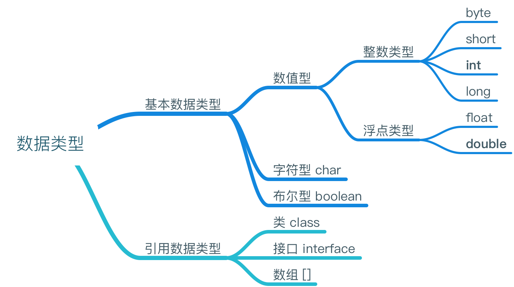

### 标识符

#### 规则

+ 数字不能开头
+ 不可使用关键字

#### 规范

+ **包名**: 所有字母小写 **xxxyyyzzz**
+ **类名接口名**: 所有单词首字母大写 **XxxYyyZzz**
+ **变量名和函数名**: 第一个单词首字母小写，第二个单词开始每个单词首字母大写 **xxxYyyZzz**
+ **常量名**: 所有字母大写，多个单词用下划线连接 **XXX_YYY_ZZZ**

### 常量

#### Java中常量的分类

+ **整数常量**: 所有整数
+ **小数常量**: 所有小数
+ **布尔型常量**: true false
+ **字符常量**: 单引号标示
+ **字符串常量**: 双引号标示

#### 整数三种表现形式

+ 十进制: 0-9 满10进1
+ 八进制: 0-7 满8进1，三个二进制位表示一位，用0开头表示
+ 十六进制: 0-9 A-F 满16进1，四个二进制位表示一位，用0x开头表示

#### 内存换算

bit位 = 1个二进制位

byte 字节 = 8个二进制位

1k = 1024个字节

#### 基本数据类型

| 数据类型    | 内存占用             | 取值范围           |
| ------- | ---------------- | -------------- |
| byte    | 1个字节 / 8个二进制位    | -128～127       |
| short   | 2个字节 / 16个二进制位   | -2^15 ~ 2^15-1 |
| int     | 4个字节 / 32个二进制位   | -2^31 ~ 2^31-1 |
| long    | 8个字节 / 64个二进制位   | -2^63 ~ 2^63-1 |
| float   | 4个字节 / 32个二进制位   |                |
| double  | 8个字节 / 64个二进制位   |                |
| char    | 2个字节 / 16个二进制位   |                |
| boolean | 理论1bit位 / 八分之一字节 |                |

#### 负数

正数取反加一

### 变量



### 算数运算符

#### 隐式转换

byte short char 类型运算默认转换为int

#### 取模%

+ 左边小于右边 结果为 左边
+ 左边等于右边 结果为 0
+ 右边是1 结果为0
+ 左边为负数 结果为负数

#### 转义字符

+ **\n** 换行
+ **\b** 退格
+ **\r** 回车
+ **\t** 制表符

#### 赋值运算符

```java
short s = 4;
s = s + 5; //报错，5提升为int类型，运算后s转换为int
s += 5; //编译通过，+=为赋值运算符，自动强制转换
```

#### 逻辑运算符

+ **& 与** **&&** &&当左边为false时，右边不运算
+ **| 或** **||** ||当左边为true时，右边不运算
+ **^ 异或** : 与|区别 true ^ true = false，两边结果相同为false，不同为true

#### 位运算

+ **<< 左移** : 乘以2的移动位数次幂
+ **>> 右移** : 除以2的移动位数次幂
+ **>>> 无符号右移** : 最高位用0补
+ **& 与运算**
+ **| 或运算**
+ **^ 异或运算** (不同为true，相同为false）一个数异或另一个数两次，结果还是这个数

```java
//不定义第三方变量交换两个变量的值
int a = 3, b = 5;
a = a ^ b;
b = a ^ b; // (a^b)^b
a = a ^ b; // (a^b)^a
```

+ **~ 反码**

#### 三元运算符

变量 = (条件表达式)?表达式1:表达式2;  表达式必须有运算结果

### 程序流程控制

#### 判断结构

```java
if(条件表达式){
    执行语句;
}else if{
    执行语句;
}...else{
    执行语句;
}
```

#### 选择结构

```java
switch(表达式){ // byte short int char String
  case 取值1:
    执行语句;
    break;
  case 取值2:
    执行语句;
    break;
  ...
  default:
    执行语句;
    break;
}
// switch语句结束条件，遇到break或执行到结束
//当一个case内语句执行完没有break时，会执行下一个case内的语句。
```

#### 循环结构

##### while

```java
//while 先判断条件，只有条件满足才执行循环体
while(条件表达式){
    执行语句;
}
```

#### do while

```java
//do while 先执行循环体，再判断条件，循环体至少执行一次
do{
    执行语句;
}while(条件表达式);
```

##### for

```java
//for
for(初始化表达式;循环条件表达式;循环后的操作表达式;){
    执行语句;
}
```

##### 无限循环的最简单表现形式

```java
for(;;){}
while(true){}
```

### 函数

#### 函数的格式

```java
修饰符 返回值类型 函数名(参数类型 形式参数1,参数类型 形式参数2,...){
    执行语句;
  return 返回值;
}
```

#### 函数可变参数

```java
public void method(参数1,可变参数...){
  
}
// 可变参数是一个数组，接收数组的元素，简化书写。
// 注意: 可变参数类型必须定义在参数列表的
```


#### 函数重载

在同一个类中函数名相同，参数**个数**或**类型**不同，函数重载。与返回值类型无关。


### 内存的划分

1. 寄存器
2. 本地方法区
3. 方法区
4. 栈内存 
  + 储存的是局部变量
  + 变量所属作用域结束，变量自动释放
5. 堆内存
  + 存储的是数组和对象
  + 每个实体都有首地址值
  + 每个变量都有默认初始化值
    + int : 0
    + double : 0.0
    + float : 0.0f
    + boolean : false
    + char : '\u0000'
  + 垃圾回收机制

### 数组

#### 格式

```java
//元素类型[] 数组名 = new 元素类型[元素个数或数组长度];
int[] arr = new int[5];
int arr[] = new int[5];
//元素类型[] 数组名 = new 元素类型[]{元素,元素,...};
int[] arr = new int[]{1,2,3,4,5};
int[] arr = {1,2,3,4,5};
```

### 二维数组

```java
int[][] arr = new int[][]
```


### 面向对象

#### 成员变量和局部变量

+ 作用范围 : 成员变量作用于类中，局部变量作用于函数或语句中
+ 在内存中的位置 : 成员变量在堆内存的对象中，局部变量在栈内存的方法中
+ 成员变量有默认初始化值，局部变量没有默认初始化值 

#### 匿名对象

1. 当对象对**方法**仅进行**一次**调用时，就可以简化成匿名对象。
2. 匿名对象可以作为实际参数进行传递。

new 类名().成员方法();

#### 封装

**隐藏**对象的属性和实现细节，仅对外**提供**公共访问方式。

**private** 私有，修饰类中成员变量和成员函数，修饰后成员仅能在本类中访问

#### 构造函数

+ 函数名与类名相同
+ 不用定义返回值类型

对象一建立就会调用与之对应的构造函数

作用 : 可以用于给对象进行初始化

当一个类中没有定义构造函数时，系统会默认加入一个空参数构造函数 类名(){}

#### 构造代码块

优先于构造函数执行，给**所有对象**进行统一初始化 {}

####静态代码块

随着类的加载而执行，只执行一次。 static{}

作用：用于给**类**进行初始化。

#### this

所在函数所属对象的引用。

**this(参数);** 构造函数间调用，必须在构造函数第一行


#### static 静态

**static** 静态，修饰类中成员变量和成员函数，修饰后成员被**对象共享**

静态成员可以**直接被类名调用** 类名.静态成员

类中方法没有访问**特有数据**，方法定义成静态。

特点

+ 随着类的加载而加载
+ 优先于对象存在
+ 被所有对象**共享**，节省空间
+ 可以被类名调用
+ **静态方法只能访问静态成员**

#### 实例变量与类变量

+ 定义
  + 实例变量 ; 成员变量
  + 类变量 : 静态的成员变量
+ 存放位置

  + 实例变量随着对象的建立存在与堆内存中

  + 类变量随着类的加载存在于方法区中
+ 生命周期
  + 实例变量生命周期随着对象的消失而消失
  + 类变量生命周期最长，随着类的消失而消失

#### 设计模式

解决某一类问题最行之有效的方法

java中有23种设计模式

##### 单例设计模式

解决一个类在内存只存在一个对象。

1. 将构造函数私有化
2. 在类中创建一个本类对象
3. 提供一个方法获取该对象

```java
//饿汉式,先初始化对象，类一进内存就创建对象
class Single{
  private Single(){}
  private static Single s = new Single();
  public static Single getInstance(){
      return s;
  }
}
```

```java
//懒汉式，方法被调用时才初始化，延时加载，只有调用getInstance方法时才建立对象
class Single{
  private Single(){}
  private static Single s = null;
  public static Single getInstance(){
    if (s==null){
    	synchronized (Single.class){
        	if (s==null){
            	s = new Single();
            }
         }
    }
    return s;
  }
}
```

#### extends 继承

extends

单继承：一个子类只能有一个直接父类

多继承：一个子类可以有多个直接父类，java不直接支持，因为多个父类中有相同成员，会产生调用不确定性

java支持多重继承

#### 覆盖(重写)

子父类方法要一模一样(包括返回值)

子类覆盖父类，必须保证子类权限大于等于父类权限。

静态不存在重写。

#### this和super

this代表一个本类对象的引用 super代表一个父类空间

this(); 表示调用本类构造函数

super(); 表示调用父类构造函数

this();和super();都必须在构造函数第一行，所有只能存在一个。

```java
class Fu{
  Fu(){
        
  }
}
class Zi extends Fu{
  Zi(){
      //super();调用父类空参数构造函数
  }
  Zi(int x){
      //super();子类所有构造函数默认都访问父类空参数构造函数，当父类中没有空参数构造函数时，要手动指定访问父类的构造函数
  }
}
```

```java
class Fu{
  Fu(){
   System.out.println("A Fu run");
  }
  Fu(int x){
    System.out.println("B Fu run..."+x);
  }
}
class Zi extends Fu{
  Zi(){
    System.out.println("C Zi run");
  }
  Zi(int x){
    this(); //手动指定this();也必须在第一行，所以没有默认super();
    System.out.println("D Zi run..."+x);
  }
}
class ExtendsDemo{
    public static void main(String[] args){
      Zi z = new Zi(1);
      /* A Fu run
       * C Zi run
       * D Zi run...1
       */
    }
}
```

```java
class Fu{
  Fu(){
    show();
  }
  void show(){
    System.out.println("fu show");
  }
}
class Zi extends Fu{
  int num = 8;
  Zi(){
    super();
    //父类初始化完毕后，才进行子类的成员变量初始化。
    System.out.println("Zi cons run..."+num);
  }
  void show(){
    System.out.println("zi show..."+num);
  }
}
class ExtendsDemo2{
  public static void main(String[] args){
    Zi z = new Zi();
    /* Zi show...0
     * Zi cons run...8
     */
  }
}
```

#### 对象初始化过程

1. 找到类文件，并加载到内存中。
2. 执行静态代码块（如果有）。
3. 堆内存中开辟空间，分配内存地址。
4. 堆内存中建立对象特有属性，并进行默认初始化。
5. 执行构造函数，调用父类构造函数super();
6. 对属性进行显示初始化。
7. 执行构造代码块（如果有）。
8. 继续执行构造函数。
9. 将内存地址赋给栈内存中的变量。

```java
public class Test3 {
	public static void main(String[] args) {
		new Zi();
	}
}
class Fu{
	Fu(){
      	super();//Object
		//显示初始化
		//构造代码块初始化
		show();
	}
	void show() {
		System.out.println("hehe");
	}
}
class Zi extends Fu{
	int num = 9;
	{
		System.out.println("Zi counstructor code"+num);
		num = 10;
	}
  	static{
		System.out.println("Zi static code");
	}
	Zi(){
		super();
		//显示初始化
		//构造代码块初始化
		System.out.println("Zi counstructor"+num);
	}
	void show() {
		System.out.println("Zi show"+num);
	}
	/*
	 * Zi static code
	 * Zi show0
	 * Zi counstructor code9
	 * Zi counstructor10
	 */
}
```


#### final 最终

最终，可以修饰类，函数，变量

+ 被final修饰的**类**不可以被**继承**。
+ 被final修饰的**方法**不可以被**复写**。
+ 被final修饰的变量是一个**常量**，值不能被**修改**。

#### abstract 抽象

```java
abstract 类名{
    abstract void 方法名();
}
```

+ 抽象方法一定定义在**抽象类**中。
+ 抽象类不可以用new**创建对象**，因为调用抽象方法没意义。
+ 抽象类中的抽象方法要被使用，必须由子类复写**所有的抽象方法**，并建立子类对象调用。
+ 如果子类只覆盖了父类**部分抽象方法**，该子类还是一个抽象类。
+ 抽象类中可以**不定义**抽象方法。
+ abstract不能和private final static共存

 #### interface 接口

```java
interface a{
    
}
interface b{
    
}
interface c extends a,b{ //多继承
    
}
class d implements a,b,c{ //多实现
    
}
```

接口中的成员都有固定的修饰符

1. 全局常量 **public static final**
2. 抽象方法 **public abstract**

+ 接口中的成员都是public
+ 接口不可以创建对象
+ 子类必须实现接口所有抽象方法才可以创建对象，否则子类是抽象类

#### 多态

父类或者接口的引用指向其子类的对象

多态时成员变量的特点

更多详见面试题

```java
class Fu{
  int num = 3;
  void show(){
    System.out.println("Fu show");
  }
  static void method(){
    System.out.println("Fu static method");
  }
}
class Zi extends Fu{
  int num = 4;
  void show(){
    System.out.println("Zi show");
  }
  static void method(){
    System.out.println("Zi static method");
  }
}
class DuoTaiDemo3{
  public static void main(String[] args){
    Fu z = new Zi();
    System.out.println(z.num); // 3
    z.show(); // Zi show
    z.method(); // Fu static method
  }
}
```

|         | 编译时  | 运行时  |
| ------- | ---- | ---- |
| 成员变量    | 参考左边 | 参考左边 |
| 非静态成员函数 | 参考左边 | 参考右边 |
| 静态成员函数  | 参考左边 | 参考左边 |

#### 内部类

+ 在成员位置
  + 可以直接访问外部类成员，包括私有成员
  + 访问外部类非静态成员 Outer.this.成员
  + 内部类非静态 `Outer.Inner i = new Outer().new Inner();`
  + 内部类静态 `Outer.Inner i = new Outer.Inner();`

内部类中定义静态成员时，该内部类必须是静态。

内部类在局部位置上只能访问局部中的final局部变量。

#### 匿名内部类

```java
// 匿名内部类直接调用方法
new 父类或接口(){
  重写父类方法
  定义本类方法
}.父类方法()或本类方法();

// 多态调用匿名内部类方法
父类或接口 类名 new 父类或接口(){
  重写父类方法
  定义本类方法
};
类名.父类方法();
类名.本类方法(); // 不能调用本类方法 
```

#### 异常

+ Throwable
  + Error
  + Exception
    + RuntimeException

Exception 异常，除RuntimeException外都是编译时检测异常

RuntimeException 运行时异常

##### 异常声明

+ throws 使用在函数上，抛出的是异常类，可以抛出多个，用逗号隔开；
+ throw 使用在函数内，抛出的是异常对象；

##### 异常捕捉

```java
try{
    //需要被检测异常的代码
}
catch(异常类 变量){ //该变量用于接收发生的异常对象
    //处理异常的代码
}
finally{
    //一定会执行的代码
}
```

 子类在覆盖父类方法时，父类的方法如果抛出了异常，那么子类的方法只能抛出**父类的异常**或者**子类**或者**子集**。

如果父类的方法**没有抛出异常**，那么子类覆盖时**不能抛出异常**。

#### 权限标识符

|      | public | protected | default | private |
| :--: | :----: | :-------: | :-----: | :-----: |
| 同一类中 |   可以   |    可以     |   可以    |   可以    |
| 同一包中 |   可以   |    可以     |   可以    |         |
| 子类中  |   可以   |    可以     |         |         |
| 不同包中 |   可以   |           |         |         |

### 多线程

#### 创建多线程方式

1. 继承Thread类
```java
class Demo extends Thread{
  public void run(){
    show();
  }
  public void show(){
    for (int x=0; x<20; x++) {
      System.out.println(Thread.currentThread().getName()+"...."+x);
    }
  }
}
  class ThreadDemo{
  public static void main(String[] args) {
    Demo d1 = new Demo();
    Demo d2 = new Demo();
    d1.start();
    d2.start();
  }
}
```
2. 实现Runnable接口
```java
class Demo implements Runnable{ //实现Runnable接口
  public void run(){ //覆盖run方法
    show();
  }
  public void show(){
    for (int x=0; x<20; x++) {
      System.out.println(Thread.currentThread().getName()+"...."+x);
    }
  }
}
class ThreadDemo{
  public static void main(String[] args) {
    Demo d1 = new Demo();
    Demo d2 = new Demo();
    Thread t1 = new Thread(d1); //创建线程对象，并将Runnable接口的子类对象作为参数进行传递
    Thread t2 = new Thread(d2);
    t1.start(); //调用线程对象的start方法开启线程
    t2.start();
  }
}
```
#### 同步代码块

synchronized(对象){
​	需要被同步的代码
}

#### 同步函数

synchronized函数

同步函数的锁是this

#### 等待唤醒机制

方法必须定义在同步中

+ wait() 让线程处于冻结状态，被wait的线程存储在线程池中
+ notify() 唤醒线程池中一个线程（任意）
+ notifyAll() 唤醒线程池中的所有进程
+ interrupt() 将线程从冻结状态恢复到运行状态


#### 多生产多消费问题

while判断标记

notifyAll唤醒所有线程

#### wait和sleep区别

1. wait可以指定时间也可以不指定
   sleep必须指定时间
2. wait释放执行权，释放锁
   sleep释放执行权，不释放锁

#### 中断线程

```java
// 清除中断状态,线程抛出InterruptedException
interrupt();
```

#### 守护线程

当其他线程都结束时,守护线程自动结束

```java
// 设置线程为守护线程
setDaemon(true);
```


#### Lock

```java
// 创建锁
Lock lock = new ReentrantLock();
// 获取监视器
Condition con = lock.newCondition();
// 等待
con.await();
// 唤醒
con.signal();
con.signalAll();
```


#### Executors线程池

##### ExecutorService创建

```java
// 创建固定线程数线程池
ExecutorService executorService = Executors.newFixedThreadPool(线程数量);
// 创建缓存大小的线程池
ExecutorService executorService = Executors.newCachedThreadPool();
// 创建单一的线程池
ExecutorService executorService = Executors.newSingleThreadExecutor();
// 创建延时线程池
ExecutorService executorService = Executors.newScheduledThreadPool(线程数量);
```

##### ExecutorService使用

```java
// 执行
executorService.execute(实现Runnable接口类);
// 执行并返回执行结果
Future future = executorService.submit(实现Runnable接口类);
```

##### ExecutorService关闭

```java
// 执行中任务可执行完直到结束
executorService.shutdown();
// 任务立即结束
executorService.shutdownNow();
```


### String类

特点：字符串对象一旦被初始化就不会被改变

```java
String s = "abc"; // 储存在常量池中
String s1 = "abc"; // 池中有直接用，池中没有才建立
System.out.println(s==s1); // true;
System.out.println(s.equals(s1)); // true;

String s2 = new String("abc"); // 在堆中产生两个对象，不在常量池中
String s3 = new String("abc");
System.out.println(s2==s3); // false;
System.out.println(s2.equals(s3)); // true;
```

#### 字符串常用方法

```java
//1. 获取
   //1. 获取字符串中字符的个数（长度）；
      int length();
   //2. 根据位置获取字符；
      char charAt(int index);
   //3. 根据字符获取在字符串中的位置，第一次出现的位置；
      int indexOf(int ch);
      int indexOf(int ch,int fromIndex);  从指定位置进行查找；
      int indexOf(String str);
      int indexOf(String str,int fromIndex);
      int lastIndexOf(int ch);
      int lastIndexOf(int ch,int fromIndex);  从指定位置进行查找；
      int lastIndexOf(String str);
      int lastIndexOf(String str,int fromIndex);
   //4. 获取字符串中的一部分字符串；也叫子串；
      String substring(int beginIndex,int endIndex);
//2. 转换
   //1. 将字符串变成字符串数组（字符串切割）；
      String[] split(String regex);
   //2. 将字符串转成字符数组；
      char[] toCharArray();
   //3. 将字符串转成字节数组；
      byte[] getBytes();
      byte[] getBytes(String charsetName);指定编码表
   //4. 将字符串中的字母转成大小写；
      String toUpperCase();大写
      String toLowerCase();小写
   //5. 将字符串中的内容进行替换；
      String replace(char oldChar,char newChar);
//3. 判断
   //1. 两个字符串内容是否相同
      boolean equals(Object obj);
      boolean equalsIgnoreCase(String str); 忽略大小写比较字符串内容
   //2. 字符串中是否包含指定的字符串
      boolean contains(String str);
   //3. 字符串是否以指定字符串开头是否以指定字符串结尾
      boolean startsWith(String str);
      boolean endsWith(String str);
   //4. 比较
      compareTo(String str);
```


### StringBuffer

字符串缓冲区，用于存储数据的容器；

#### 特点

1. 长度可变
2. 可以存储不同类型的数据

#### 功能

```java
//1. 添加
StringBuffer append(data);
StringBuffer insert(index,data);
//2. 删除
StringBuffer delete(int start,int end);
//3. 查找
char charAt(index);
int indexOf(String str);
int lastIndexOf(String str);
//4. 修改
StringBuffere replace(start,end,string);
```


#### StringBuffer 与 StringBuilder 的区别

StringBuffer是线程同步的，通常用于多线程。

StringBuilder是不同步的，通常用于单线程。


### 集合

#### 特点

1. 用于储存对象的容器
2. 集合的长度是可变的
3. 集合中不可以存储基本数据类型值

#### Collection常见方法

```java
//1.添加
boolean add(Object obj);
boolean addAll(Collection coll);
//2.删除
boolean remove(Object obj);
boolean removeAll(Collection coll);
void clear();
//3.判断
boolean contains(Object obj);
boolean containsAll(Collection coll);
boolean isEmpty();
//4.获取
int size();
Iterator iterator();
//迭代器
//在迭代过程中，不要使用集合操作元素，容易出现异常。
//对于List可以使用ListIterator在迭代中对元素进行更多的操作。
Collection coll = new ArrayList();
for(Iterator it = coll.iterator();it.hasNext();){
  System.out.println(it.next());
}
//5.其他
boolean retainAll(Collection coll);
Object[] toArray();
```

#### List常见方法

```java
//1.添加
void add(index,element);
void add(index,collection);
//2.删除
Object remove(index);
//3.修改
Object set(index,element);
//4.获取
Object get(index);
int indexOf(object);
int lastIndexOf(object);
List subList(from,to);
```


#### Collection

+ List **有序**（存入和取出的顺序一致），元素都有索引，元素**可以重复**
+ Set 元素**不能重复**

#### List

+ Vector 内部是数组数据结构，是同步的。增删查询都很慢。
+ ArrayList 内部是**数组**数据结构，是不同步的。替代了Vector，**查询速度快**。
+ LinkedList 内部是**链表**数据结构，是不同步的。**增删元素的速度很快**。

#### Set

+ HashSet 内部数据结构是**哈希表**，是不同步的。

  + LinkedHashSet 元素**有序**并且唯一。

  因为内部数据结构是哈希表，所以存储元素的时候，使用元素的**hashCode**方法来确定位置，如果值相同，再使用**equals**方法来确定是否相同，相同不再存储。

+ TreeSet 可以对Set集合中的元素进行**排序**，是不同步的。

  TreeSet对元素进行排序的方式

         	1. 让元素自身具备比较功能，元素实现Comparable接口，覆盖compareTo方法
          	2. 让集合自身具备比较功能，定义一个类实现Comparator接口，覆盖compareTo方法。将该类作为参数传递给TreeSet集合的构造函数。

#### Map

存储的是键值对，键唯一，一次添加一对元素，Map集合也称双列集合

Set底层是由Map实现

+ Hashtable 内部结构是哈希表，是同步的。不允许null作为键，null作为值。
  + Properties 用来存储键值对型的配置文件的信息，可以和IO技术相结合。
+ HashMap 内部结构是哈希表，不是同步的。允许null作为键，null作为值。
  + LinkedHashMap **有序**
+ TreeMap 内部结构是二叉树，不是同步的。可以对Map集合中的键进行排序。

#### 泛型

1. 将运行时期的问题ClassCastException转移到了编译时期。
2. 避免了强制转换的麻烦。
3. 生成的class文件中是不带泛型的，称之为泛型的擦除。

当方法静态时，不能访问类上定义的泛型。如果静态方法使用泛型，只能将泛型定义在方法上。

```java
public class 类名<泛型>{
    public static <泛型> void method(泛型 obj){
    
	} 
}
```

? 泛型通配符

? extends E 接收E类型或者E的子类型对象。上限

? super E 接收E类型或者E的父类型。下限

##### 常用方法

```java
//1.添加
value put(key,value) 返回前一个和key关联的值，如果没有返回null

//2.删除
void clear() 清空集合
value remove(key) 根据指定的key删除键值对

//3.判断
boolean containsKey(key)
boolean containsValue(value)
boolean isEmpty()

//4.获取
value get(key) 通过键获取值，如果没有,返回null
int size() 获取键值对的个数

//5.获取集合
Set<K> keySet() 返回Map的key的集合
Set<Map.Entry<K,Y>> entrySet() 获取key value映射关系集合
Collection<V> values() 返回Map的value的集合
```

##### Properties常用方法

```java
// 1.创建对象
Properties ps = new Properties();

// 2.加载配置文件
ps.load(输入流);

// 3.获取值
ps.getProperty(键);
```


#### 集合框架工具类

```java
//1.排序
void sort(list);
void sort(list,比较器);
//2.反转
void reverse(list);
比较器reverseOrder();
比较器reverseOrder(比较器);
//3.替换
void shuffle(list); 随机替换元素位置
void fill(list,obj); 使用指定元素替换所有元素
```


##### List asList(数组) 将数组转成集合

好处：可以使用集合的方法操作数组中的元素。

注意：数组的长度是固定的，所以对于集合的增删方法是不可以使用的，否则会发生异常。

如果数组中的元素是对象，转成集合时，直接将数组中的元素作为集合中的元素进行集合存储。

如果数组中的元素是基本数据类型数值，会将该数组作为集合中的元素进行存储。

#### Date

毫秒值转日期

1. 通过Date对象的构造方法 new Date(timeMillis);
2. 通过setTime设置

日期转毫秒值

1. getTime方法

### IO流

字符流 = 字节流 + 编码表

#### 字节流

+ InputStream
  + FileInputStream
  + ObjectInputStream
+ OutputStream
  + FileOutputStream
  + ObjectOutputStream

#### 字符流

+ Reader
  + BufferedReader
  + InputStreamReader
+ Writer
  + BufferedWriter
  + OutputStreamWriter
  + PrintWriter
+ File

#### Properties集合

+ Map
  + Hashtable
    + Properties

特点

1. 该集合中的键和值都是字符串类型
2. 集合中的数据可以保存在流中，或者从流获取
3. 通常该集合用于操作以键值对形式存在的配置文件


### 网络结构

1. C / S	client / server	客户端和服务端都需要编写
  2. B / Sbrowser / server  客户端由浏览器取代

### 反射

#### 获取字节码对象的方式

1. getClass() 方法

   必须明确具体的类，并创建对象。

2. 类名.class 属性

3. Class.forName(String str); 必须传入类的全名

#### Class对象常用方法

```java
// 获取指定构造函数
Constructor getConstructor(参数类型.class)
// 获取所有构造函数(public修饰)
Constructor[] getConstructors()
  
// 使用空参构造函数创建对象
newInstance()
  
// 获取公共成员变量
Field getField(变量名)
Field[] getFields()
  
// 获取已声明的成员变量
Field getDeclaredField(变量名)
Field[] getDeclaredFields()
  
// 获取成员方法
Method getMethod(方法名,方法参数)
Method[] getMethod()
```

#### Constructor对象常用方法

```java
// 使用此构造函数创建对象
newInstance(参数)
```

#### Field对象常用方法

```java
// 获取字段值
get(对象)
// 设置字段值
set(对象,字段值)
```

#### Method对象常用方法

```java
// 让指定对象调用该方法
invoke(对象,方法参数)
```


#### AccessibleObject对象常用方法

Constructor, Field, Method都继承AccessibleObject

```java
// 取消对象成员默认访问权限检查
isAccessible(true)
```

