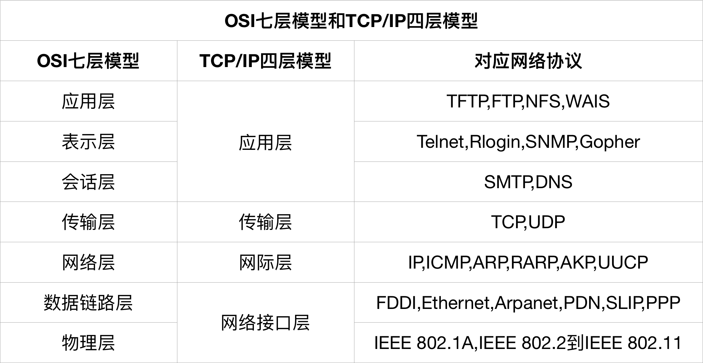

## JavaSE基础

### Java面向对象

#### 面向对象特征

+ 封装
+ 继承
+ 多态
+ 抽象

#### 访问权限修饰符

|    修饰符    | 当前类  | 相同包  |  子类  | 其他包  |
| :-------: | :--: | :--: | :--: | :--: |
|  public   |  可以  |  可以  |  可以  |  可以  |
| protected |  可以  |  可以  |  可以  |      |
|  default  |  可以  |  可以  |      |      |
|  private  |  可以  |      |      |      |

#### 对象clone

```java
// 1. 实现Cloneable接口
// 2. 重写clone方法
public class Person implements Cloneable{
    @Override
    protected Object clone() throws CloneNotSupportedException {
        return super.clone();
    }
}

public class Test{
	Person p = new Person();
  	Person p1 = (Person) p.clone();
}
```

##### 浅拷贝和深拷贝

+ 浅拷贝 : 被拷贝对象中的对象只拷贝引用
+ 深拷贝 : 被拷贝对象中的对象创建新对象

clone是浅拷贝

```java
// 深拷贝
public class Body implements Cloneable {
    public Head head;

    @Override
    protected Object clone() throws CloneNotSupportedException {
        Body body = new Body((Head) this.head.clone());
        return body;
    }
}

public class Head implements Cloneable{
    public String face;

    @Override
    protected Object clone() throws CloneNotSupportedException {
        return super.clone();
    }
}
```

#### String

String是final类,不可以被继承.

### 抽象abstract

以下不能和抽象方法共存

+ private (无法重写)
+ final (无法重写)
+ static (无法重写)
+ native (native由本地代码实现,抽象方法没有实现)
+ synchronized (synchronized与实现细节有关,抽象方法没有实现)

### 常见的RuntimeException

+ java.lang.NullPointerException 空指针异常
+ java.lang.ClassNotFoundException 类未找到异常
+ java.lang.IndexOutOfBoundsExcetion 数组角标越界异常
+ java.lang.NumberFormatException 字符串转为数字异常
+ java.lang.ClassCastException 数据类型转换异常
+ java.lang.NoSuchMethodException 方法不存在异常

### 常用API

#### switch作用类型

+ Java5以前 : byte short char int
+ Java5添加 : enum
+ Java7添加 : String

#### String

##### String对象的intern()方法

返回常量池中对应的字符串,如果常量池中没有就添加字符串到常量池,再返回.

```java
String s1 = "Programming";
String s2 = new String("Programming");
String s3 = "Program";
String s4 = "ming";
String s5 = "Program" + "ming";
String s6 = s3 + s4;
System.out.println(s1 == s2);			// false
System.out.println(s1 == s5);			// true
System.out.println(s1 == s6);			// false
System.out.println(s1 == s6.intern());	// true
System.out.println(s2 == s2.intern());	// false
```

#### Integer

```java
Integer f1 = 100;
Integer f2 = 100;
Integer f3 = 150;
Integer f4 = 150;
System.out.println(f1 == f2);	// true
System.out.println(f1 == f2);	// false
```

如果整型字面量的值在-128到127之间,不会创建新的Integer对象,直接引用常量池中的Integer对象.

### 集合

+ **Collection** 单列集合
  + **List** 有序, 元素可以重复
    + **ArrayList** 数组结构, 线程不同步, 查询快, 增删慢
    + **LinkedList** 链表结构(循环双向链表), 线程不同步, 增删快, 查询慢
    + **Vector** 数组结构, 线程同步, 增删查询都慢
  + **Set** 元素不能重复, 底层由Map实现
    + **HashSet** 哈希表结构, 线程不同步
      + **LinkedHashSet** 有序
    + **TreeSet** 二叉树结构, 线程不同步, 可以排序
+ **Map** 双列集合, 存储的是键值对，键唯一
  + **HashMap** 哈希表结构, 线程不同步, 允许null键null值
    + **LinkedHashMap** 有序
  + **TreeMap** 二叉树结构, 线程不同步, 可以排序
  + **Hashtable** 哈希表结构, 线程同步, 不允许null键null值
    + **Properties**

### 多线程

#### 线程和进程的区别

+ 进程 : 具有一定独立功能的程序关于某个数据集合上的一次运行活动,是操作系统进行资源分配和调度的一个独立单位
+ 线程 : 是进程的一个实体,是cpu调度和分派的基本单位,是比进程更小的可以独立运行的基本单位

#### 创建多线程的方式

+ 继承Thread类
+ 实现Runnable接口
+ 实现Callable接口 (Java5之后)

#### wait和sleep的区别

1. wait可以指定时间,也可以不指定

   sleep必须指定时间

2. wait释放执行权,释放锁

   sleep释放执行权,不释放锁

3. wait通常被用于线程间交互

   sleep通常被用于线程暂停执行

#### 线程的五种状态

+ 新建状态 (new创建一个线程)
+ 就绪状态 (调用start方法)
+ 运行状态 (获得cpu时间)
+ 阻塞状态 (暂时让出cpu)
+ 死亡状态 (调用isAlive方法返回false)

### 动态代理

```java
DemoImpl demo = new DemoImpl();
// 创建代理对象
Demo proxyInstance = (Demo) Proxy.newProxyInstance(
  	// 类加载器
  	demo.getClass().getClassLoader(),
  	// 代理对象接口的实现类数组
  	demo.getClass().getInterfaces(),
  	new InvocationHandler() {
	/**
     * @param proxy 代理对象
     * @param method 目标方法的字节码对象
     * @param args 调用目标方法时的参数
     * @return 代理对象调用方法的返回值
     */
  	@Override
	public Object invoke(Object proxy, Method method, Object[] args) throws Throwable {
		System.out.println("before");
        Object invoke = method.invoke(demo, args);
        System.out.println("after");
        return invoke;
    }
});

proxyInstance.method();
```


### [设计模式](设计模式.md)

### [JVM](JVM.md)

## JavaWEB

### 网络模型



### Http协议

应用层协议,无连接,无状态

#### Http协议版本

+ Http1.0 : 默认使用短连接
+ Http1.1 : 默认使用长连接
+ Http2.0 : 多路复用,http头压缩

#### Http请求

```http
// 请求行
// 请求方法 请求路径 协议版本
POST /form.html HTTP/1.1
// 请求头(消息报头)
Accept: text/html, image/gif, ... // 指定客户端接受类型
Accept-Charset: iso-8859-1,gb2312 // 指定客户端接受字符集,缺省任何字符集都可以接受
Accept-Encoding: gzip,deflate
User-Agent: Mozilla/5.0 (Macintosh; Intel Mac OS X 10_13_3) AppleWebKit/604.5.6 (KHTML, like Gecko) Version/11.0.3 Safari/604.5.6 // 客户端信息
HOST: www.demo.cn
Content-Length: 22
Connection: Keep-Alive
Cache-Control: no-cache

// 请求体(请求正文)
user=zhangsan&pwd=1234
```

#### Http响应

```http
// 响应行(状态行)
// 协议版本 状态码 状态描述
HTTP/1.1 200 OK
// 请求头(消息报头)
Server: Apache-Coyote/1.1 //  服务器信息
Last-Modified: 时间 // 资源最后修改时间

// 请求体(请求正文)
```

#### Http常见状态码

+ 200 OK 请求成功
+ 301 Moved Permanently(永久移除) 请求的URL已移走
+ 302 Found 重定向
+ 400 Bad Request 请求语法错误,服务器不能解析
+ 403 Forbidden 服务器收到请求,但拒绝提供服务
+ 404 请求资源不存在
+ 500 Internal Server Error 服务器发生不可预期的错误
+ 503 Server Unavailable 服务器当前不能处理请求,一段时间后可能恢复

#### GET和POST区别

1. GET请求数据在URL之后,以?开始,多个参数用&相连

   POST请求数据在请求体中

2. GET请求数据大小有限制,取决于浏览器对URL长度的限制

   POST对请求数据没有限制

3. POST安全性比GET高

#### 重定向和转发的区别

1. 重定向两次请求,地址栏变化

   转发一次请求,地址栏不变

2. 重定向可以访问外部网站

   转发只能访问内部资源

3. 重定向传输的数据会丢失

   转发传输的数据不会丢失

4. 转发性能优于重定向

### Cookie和Session

#### Cookie和Session的区别

1. Cookie是服务器发给浏览器的一块信息,存储在浏览器,当浏览器访问这个服务器时会携带这个Cookie.

   Session是存储在服务器的一块信息,用来存储用户的信息.

2. Cookie只能存储String类型

   Session可以存储任意对象

### Jsp

#### Jsp和Servlet的区别

Jsp是html中嵌入Java代码,侧重显示,是MVC中的V,Jsp第一次访问时会被翻译成Servlet

Servlet侧重逻辑控制,是MVC中的C

#### Jsp四大作用域

域对象 : pageContext < request < session < application

作用范围 : 当前页面 < 一次请求 < 当前会话 < 当前web应用

#### Jsp九大内置对象

| 名称          | 类型                  | 描述                |
| ----------- | ------------------- | ----------------- |
| request     | HttpServletRequest  | 得到用户请求信息          |
| response    | HttpServletResponse | 服务器向客户端的回应信息      |
| session     | HttpSession         | 用来保存用户的信息         |
| application | ServletContext      | 所有用户的共享信息         |
| page        | Object              | 当前页面转换后的Servlet实例 |
| pageContext | PageContext         | JSP的页面容器          |
| out         | JspWriter           | 用于页面输出            |
| config      | ServletConfig       | 服务器配置，可以取得初始化参数   |
| exception   | Throwable           | JSP页面发生的异常，错误页中有效 |

### AJAX

Ajax是一种创建交互式网页应用的网页开发技术

优点 : 

​	使用异步模式,响应速度快

​	实现局部刷新,用户体验好

​	AJAX引擎在客户端运行,分担了服务器压力

缺点 : 

​	不支持浏览器back按钮

## 数据库

### SQL语句执行流程

` select 聚合函数(列) from 表 where 条件 group by 列 having 条件 order by 列 `

select语句执行顺序

1. from语句组装来自不同数据源的数据
2. where根据指定的条件对记录进行筛选
3. group by 对结果进行分组
4. 使用聚合函数进行计算
5. having对分组数据进行筛选
6. select筛选需要的字段
7. order by对结果排序

以上每个步骤都会生成一个虚拟表,作为下一步的输入,这些表对调用者不可以,只有最后一步生成的表才会给调用者

### 连接查询

+ **外连接**
  + **左外连接** 以左表为基准,左表内容全部显示,右表与左表匹配显示数据,不匹配显示null
  + **右外连接** 以右表为基准,右表内容全部显示,左表与右表匹配显示数据,不匹配显示null
  + **全连接** 先以左表进行左外连接,再以右表进行右外连接(mysql不支持)
+ **内连接** 显示表之间有连接匹配的所有行


### MySQL性能优化

1. 当只查询一条数据时使用limit 1
2. 使用join的时候尽量用小的结果驱动大的结果(left join时把小表放左边,如果左边表有条件判断,在左边先处理)
3. 用not exists替代not in,因为not exists使用已建立好的索引,而not in不能使用索引
4. 尽量不使用不利于索引的操作,in,not in,is null,is not null,<>等
5. 尽量避免在列上做运算,会使索引失效
6. 为经常查询的字段建立索引,语法alter table 表名 add index(字段名)

### MySQL存储引擎

+ **InnoDB** MySQL的默认引擎,支持事物,行锁和外键
+ **MyISAM** 拥有较高的插入查询速度,但不支持事物
+ **MEMORY** 将数据存储到内存
+ **Maria** 新开发的引擎,用来替代MyISAM

### MySQL事务

#### 事务介绍

事务就是为了让一组查询要么全部成功,要么全部失败.

MySQL和其他数据库不同,事务是由存储引擎决定的.

MySQL的事务默认是自动提交.

#### 事务四大特性

+ **原子性** 整个事务中的操作要么全部成功,要么全部失败
+ **一致性 ** 事务开始前和事务结束后,数据库的完整性约束没有被破坏
+ **隔离性** 有多个事务同时执行时,事务之间相互隔离,互不影响
+ **持久性** 事务结束后,事务对数据的操作持久保存在数据库中,不会被回滚

#### MySQL中四种隔离级别

+ **读未提交**
+ **读已提交**
+ **可重复读** (MySQL默认隔离级别)
+ **串行化**

## 框架

### SpringMVC

#### SpringMVC工作流程


