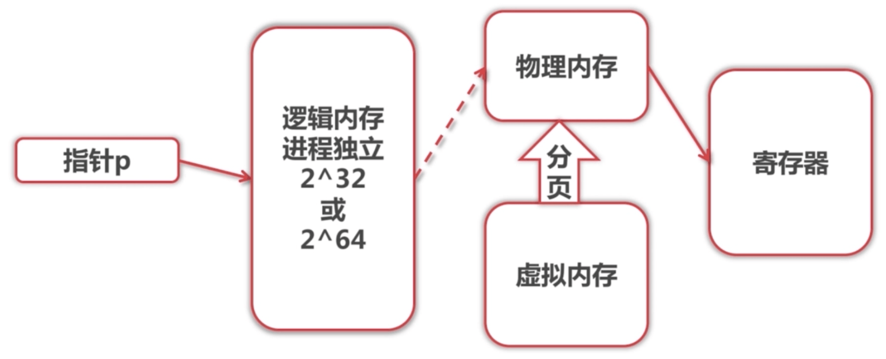
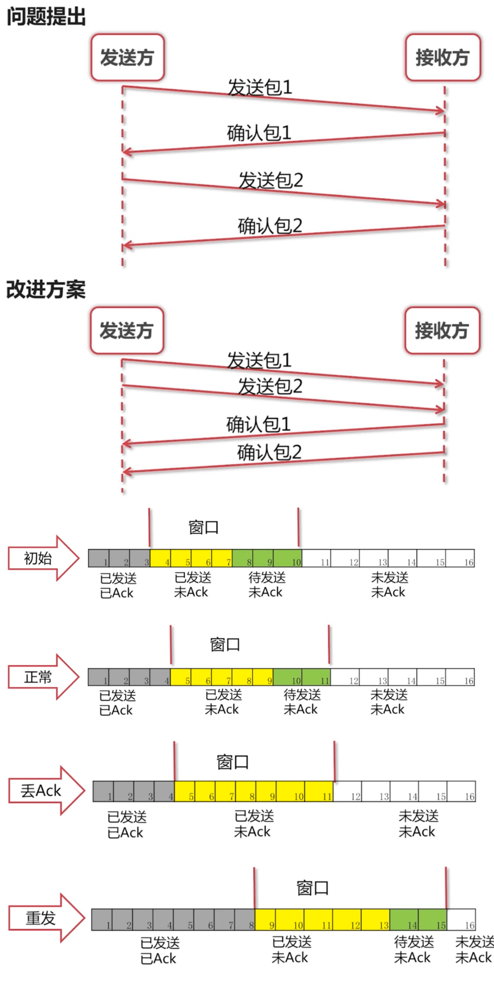

## 操作系统

### 存储

+ 寄存器 (速度快,价格高)
+ 缓存
+ 内存
+ 硬盘 (速度慢,价格低)

### 寻址空间

与物理内存无关

+ 32位系统 > 4G
+ 64位系统 > 10^19 Byte
+ 64位JVM > 可使用更大内存,需重新编译

#### 寻址

` int n = *p; > MOV EAX,[EBX] `

指针p指向逻辑内存,逻辑内存对应物理内存,物理内存根据分页载入虚拟内存,找到p指向的内存载入寄存器.

## 网络

### 网络模型

### 滑动窗口协议

+ TCP协议中使用
+ 维持发送方/接收方缓冲区(解决网络传输不可靠问题)

