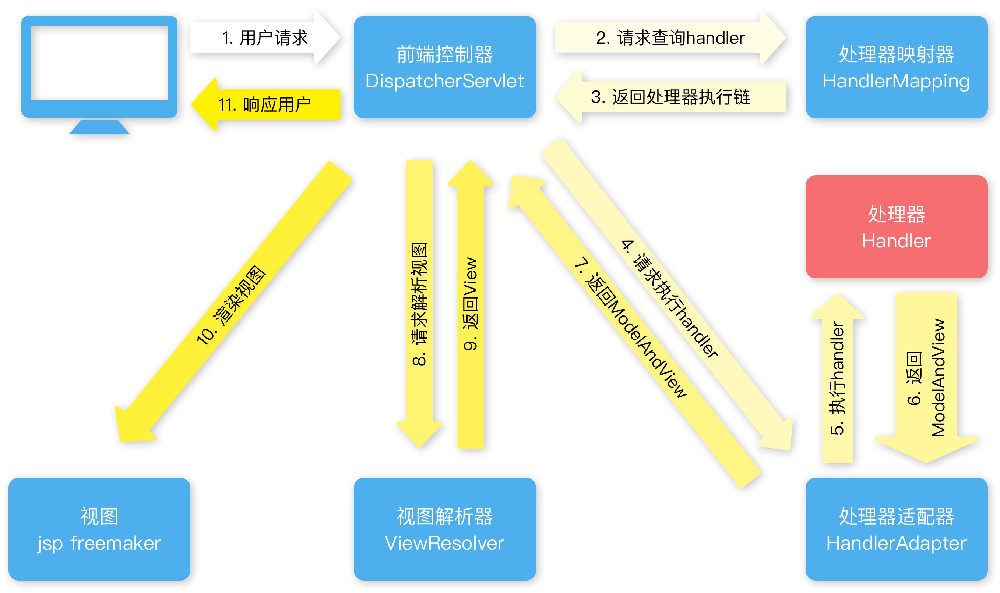

### SpringMVC执行流程



### 配置前端控制器

```xml
<servlet>
	<servlet-name>SpringMVC</servlet-name>
    <servlet-class>org.springframework.web.servlet.DispatcherServlet</servlet-class>
    <init-param>
        <param-name>contextConfigLocation</param-name>
        <param-value>classpath:SpringMVC.xml</param-value>
    </init-param>
</servlet>
<servlet-mapping>
    <servlet-name>SpringMVC</servlet-name>
    <url-pattern>*.action</url-pattern>
</servlet-mapping>
```

### 配置视图解析器

```xml
<bean class="org.springframework.web.servlet.view.InternalResourceViewResolver">
	<!-- 前缀 -->
    <property name="prefix" value="/WEB-INF/jsp/"/>
    <!-- 后缀 -->
    <property name="suffix" value=".jsp"/>
</bean>
```

### 配置注解驱动

` <mvc:annotation-driven/> `

### Controller类

```java
@Controller
@RequestMapping(value = "请求前缀")
public class 类名 {
  	// 请求URL映射
    @RequestMapping(value = "请求路径")
  	// 多个请求URL映射
  	@RequestMapping(value = {"请求路径1","请求路径2"})
  	// 指定方法请求URL映射
  	@RequestMapping(value = "请求路径", method=RequestMethod.请求方式)
  	// 返回对象转为json
  	@ResponseBody
    public String list(Model model, @RequestParam(value="请求参数")){
        return "视图地址";
      	return "redirect:视图地址";
      	return "forward:视图地址";
    }
```

### 解决POST请求乱码

web.xml

```xml
<filter>
    <filter-name>encoding</filter-name>
    <filter-class>org.springframework.web.filter.CharacterEncodingFilter</filter-class>
    <init-param>
        <param-name>encoding</param-name>
        <param-value>UTF-8</param-value>
    </init-param>
</filter>
<filter-mapping>
    <filter-name>encoding</filter-name>
    <url-pattern>*.action</url-pattern>
</filter-mapping>
```
### 解决GET请求乱码

+ 修改 tomcat 配置文件添加编码与工程编码一致
+ 对参数进行重新编码 ` String userName = new String(Request.getParameter("userName").getBytes("ISO8859-1"),"utf-8"); `